  <picture>
    <source media="(max-width: 600px)" srcset="./banner-mobile.svg">
    
  </picture>

  

    
    
    
    
  

<picture>
  <source media="(max-width: 600px)" srcset="./about-mobile.svg">
  
</picture>

 

<picture>
  <source media="(max-width: 600px)" srcset="./tech-stack-mobile.svg">
  
</picture>

## Selected projects

### 01 &nbsp; Smart Crop Disease Detection

A leaf-image workflow for crop disease detection, treatment recommendations, and prediction history. Combines a React interface and authenticated API with a Python / MobileNetV2 model pipeline.

`React` `Node.js` `MongoDB` `Python` `TensorFlow` `OpenCV`

[Explore the code &rarr;](https://github.com/Hussain-188/mini-project)

### 02 &nbsp; EduConnect

A learning and alumni platform for students, alumni, professors, and management. Includes role-based access, assessments, alumni networking, and resume analysis.

`React` `TypeScript` `Spring Boot` `Spring Security` `MongoDB`

[Explore the code &rarr;](https://github.com/Hussain-188/EduConnect)

### 03 &nbsp; PDF Editor

A web application for editing PDFs, merging and splitting files, and adding watermarks, backed by a Java service. A project at the intersection of browser interfaces and document processing.

`React` `TypeScript` `Java` `Spring Boot` `Docker`

[Explore the code &rarr;](https://github.com/Hussain-188/pdf-editor)

## Experience & milestones

- **GEM3S Technologies - Front End Developer Intern** &middot; June-July 2025. Built responsive React applications, integrated REST APIs, and worked with Git in an Agile team.
- **B.E. Computer Science** &middot; St. Joseph's Institute of Technology &middot; September 2023-present.
- **Inter-college hackathon winner** &middot; First place among 60+ teams.
- **Certifications** &middot; Meta: Introduction to Front-End Development; MongoDB: Associate Developer.

## Problem solving & activity

I practice data structures and algorithms in Java. Explore my [NeetCode submissions](https://github.com/Hussain-188/neetcode-submissions), [LeetCode profile](https://leetcode.com/u/Hussain188/), and [GitHub contributions](https://github.com/Hussain-188).

  
  

  

  

## Contribution activity

  <a href="https://github.com/Hussain-188?tab=overview">
    <picture>
      <source media="(max-width: 600px)" srcset="https://raw.githubusercontent.com/Hussain-188/Hussain-188/output/activity-mobile.svg">
      
    </picture>
  </a>

  <a href="https://github.com/Hussain-188?tab=overview">
    <picture>
      <source media="(prefers-color-scheme: dark)" srcset="https://raw.githubusercontent.com/Hussain-188/Hussain-188/output/snake-dark.svg">
      
    </picture>
  </a>

  
  
  
  

  

---

  <strong>Let's build something useful.</strong> 
  <a href="mailto:mohamedhussain18820@gmail.com">mohamedhussain18820@gmail.com</a> &nbsp; &middot; &nbsp;
  <a href="https://www.linkedin.com/in/mohamedhussain18/">LinkedIn</a>

